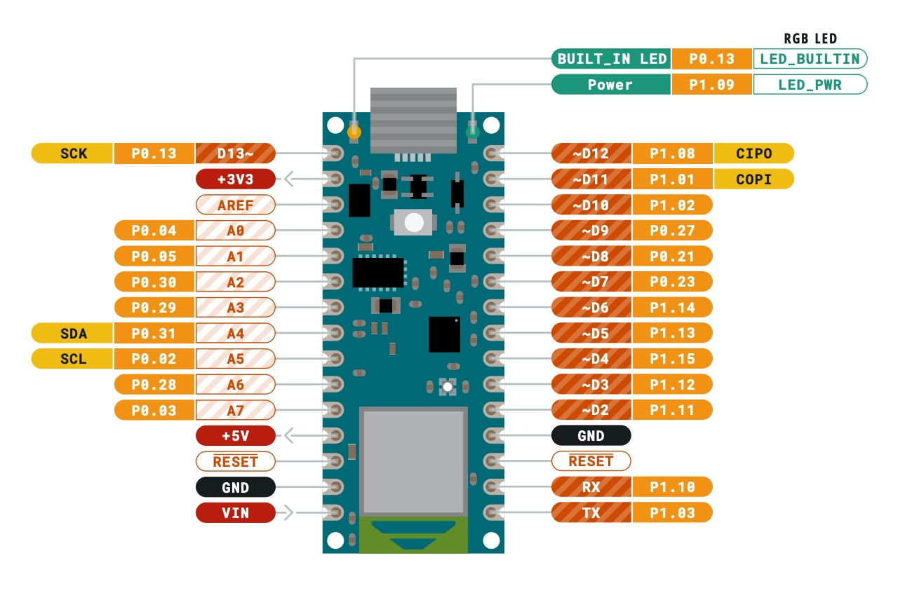
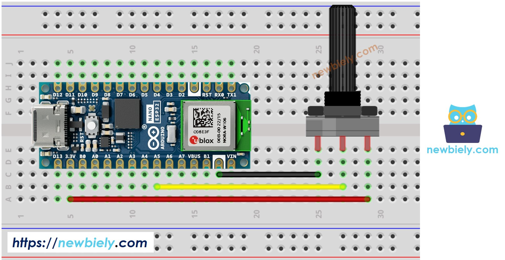
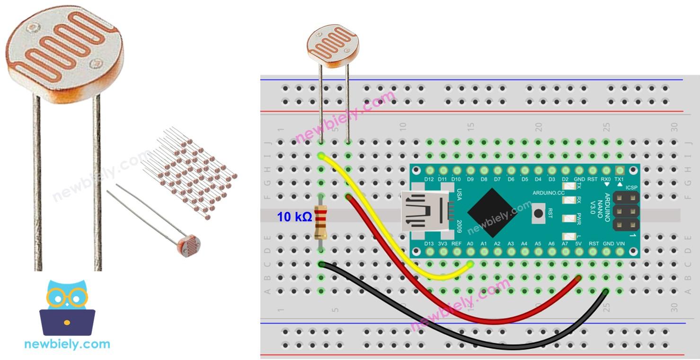

## Week 10 Activities

- Final project discussion
- Arduino workshop

---

## Class notes

# Arduino workshop
## Step 1: Download Arduino Software and Set up p5.js

 1. Download Arduino IDE [here](https://www.arduino.cc/en/software/)
 2. Make sure you have either Chrome or Edge browser installed (as WebSerial doesn't work in other web browsers currently)
 3. Create a copy of your p5.js template folder, rename it to "arduino" 
 4. Edit the "index.html" file, adding the following line to the `<head>` area: `<script  src="https://unpkg.com/@gohai/p5.webserial@^1/libraries/p5.webserial.js"></script>`
The entire `<head>` element should look like this:
```
<script  src="https://cdn.jsdelivr.net/npm/p5@1.7.0/lib/p5.js"></script>
<script  src="https://unpkg.com/@gohai/p5.webserial@^1/libraries/p5.webserial.js"></script>
<script  src="sketch.js"></script>
```

## Step 2: Getting to know your Arduino
1. Get to know your breadboard. A breadboard is a tool for prototyping electronic circuits without soldering. It's made up of an array of holes, which fit the **pins** of different electronic components. **Rows** of holes (typically numbered) are connected together on either side of the valley that runs up the middle of the breadboard. This diagram shows the way that the breadboard rows are connected:


2. Insert your Arduino into your breadboard like this:


3. The Arduino's pins all have different functions. Unfortunately, they're not labelled on the Arduino itself, so please refer to this pinout diagram:



4. The first thing we are going to experiment with is a potentiometer, which is a rotary dial. It produces different amounts of resistance depending on how far in either direction it is turned. It also functions as a voltage divider, providing a variable voltage out of its middle pin if we run some current through it.



5. Use hookup cables to connect the leftmost pin of your potentiometer into an Arduino pin labeled GND. Use another cable to plug the rightmost pin of your potentiometer into an Arduino pin labeled "+3V3+ (3.3 volts). Finally, connect the middle pin of the potentiometer to the pin labeled "A0" (analog input 0)

## Step 3: Arduino IDE
1. Put the following code into a new document in the Arduino IDE:

```
void  setup() {
   Serial.begin(9600); // initialize serial communications
}

void  loop() {
   int potentiometer = analogRead(A0); // read the input pin
   Serial.println(potentiometer);
   delay(50); // slight delay to stabilize the ADC and account for drawing speed
}
```

2. Connect your Arduino via USB. Select the connected board in the Arduino IDE, then upload your code to your Arduino.
3. Open the Serial Monitor. Notice how the numbers change when you rotate the potentiometer.

## Step 4: P5.JS

1. Paste the following code into your sketch.js file (making sure you've added the above mentioned line to your index.html file)

```
// graphs sensor data from an analog 
// sensor on A0 to the window

let port; // object to hold serial port
let c; // button
let sensorValue = 0;

function setup() {
  createCanvas(windowWidth, windowHeight);
  //colors
  colorMode(HSB);
  // create instance of the lib
  port = createSerial();

  // ports can be opened via a dialog after
  // user interaction (see connectBtnClick below)
  c = createButton('Connect to Arduino');
  c.position(10, 10);
  c.mousePressed(connectBtnClick);
}

function draw() {
  background(220, 100, 50);
  // read serial bufffer
  let str = port.readUntil("\n");
  // get rid of whitespace
  str.trim();
  // if there's valid data
  if (str.length > 0) {
    sensorValue = str;
  }
  let circleD = map(sensorValue,0,1023,0,width);
  circle(width/2,height/2,circleD);


  // changes button label based on connection status
  if (!port.opened()) {
    c.html('Connect to Arduino');
  } else {
    c.html('Disconnect');
  }
}
// if the connect button is clicked and there's
// no connection, look for something named
// "Arduino"
function connectBtnClick() {
  if (!port.opened()) {
    port.open('Arduino', 9600);
    
  } else {
    port.close();
  }
}
```

2. Preview your code in VSCode, but then open it in Chrome or Edge by clicking the menu beside the preview URL in Vscode and selecting "Open in Browser"
3. Click on the "Connect to Arduino" button. You should see the circle increase and decrease in size depending on your interactions with the potentiometer.

## Step 5: Adding additional sensors

The above code only works for a single sensor. You can use a number of analog and digital (on/off) sensors at once by sending them as a delimited list from the Arduino to p5.js.

Arduino code for 2 analog sensors (plugged into A0 and A1):

```
void setup() {
 Serial.begin(9600); // initialize serial communications
}
 
void loop() {
 int potentiometer = analogRead(A0);                    // read the input pin
 int photocell = analogRead(A1);
 Serial.print(potentiometer);
 Serial.print(" ");                                    // space for delimiting sensor data
 Serial.println(photocell);
 delay(50);                                            // slight delay to stabilize the ADC and account for drawing speed
}
```

Arduino code for 2 analog sensors and 1 digital sensor:

```
void setup() {
 Serial.begin(9600); // initialize serial communications
 pinMode(2,INPUT_PULLUP);
}
 
void loop() {
 int potentiometer = analogRead(A0);                    // read the input pin
 int photocell = analogRead(A1);
 int button = digitalRead(2);
 Serial.print(potentiometer);
 Serial.print(" "); // space for delimiting sensor data
 Serial.print(photocell);
 Serial.print(" "); // space for delimiting sensor data
 Serial.println(button);
 delay(50);                                            // slight delay to stabilize the ADC and account for drawing speed
}
```

P5.js code snippet that shows how to parse space delimited data from serial port:

```
  // read serial bufffer
  let str = port.readUntil("\n");
  // split space delimited string into array of strings
  let sensorValues = str.split(" ");
  // if there's valid data
  if (str.length > 0) {
    potentiometer = sensorValues[0]; // extract potentiometer value
    photoCell = sensorValues[1]; // extract photoCell value
    pushButton = sensorValues[2]; // extract button state (0 or 1)
  }

  let circleD = map(potentiometer,0,1023,0,width);
  let brightness = map(photoCell,200,500,0,100);
  if(pushButton == 0){
    strokeWeight(10);
    stroke("white");
  } else {
    noStroke();
  }
  fill(20,100,brightness);
  circle(width/2,height/2,circleD);
```

## Attaching a Photocell

Photocells are light sensitive resistors. They can be turned into Arduino-compatible sensors when placed in a [voltage divider](https://en.wikipedia.org/wiki/Voltage_divider) circuit.

To attach a photocell:

 - Place both legs of the photocell in independent rows of your breadboard
 - Connect one end of your photocell to a pin on the Arduino labeled GND
 - Connect the other leg of the photocell to a resistor (5k)
 - Connect the other leg of that resistor to a pin on the Arduino labeled 3V3
 - Connect a cable from the junction of the two components (the resistor and the photocell) to an analog input pin on the Arduino (A1 for instance)

Diagram:


## Attaching a pushbutton

Pushbuttons are digital sensors, since they only have two states, on or off. They can be connected to the digital pins on the opposite side of the Arduino from the analog pins.

Diagram:

